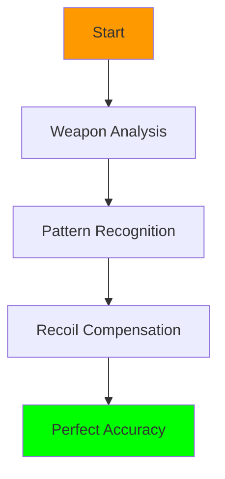

# NeuralAim - Revolutionary AI-Powered CS2 Enhancement Suite

<div align="center">
  


[](https://neuralaim.com/download)
[](https://neuralaim.com/stats)

### 🎮 Unleash Your True Gaming Potential 🎯
*The Future of CS2 Enhancement is Here*

[🌟 Features](#features) • [💎 Premium](#premium) • [📚 Guide](#guide) • [🤝 Support](#support)

---

> *"The most sophisticated AI-driven gaming enhancement ever created"*

</div>

## 🎯 Performance Metrics

| Metric | Performance | Industry Standard |
|--------|------------|-------------------|
| 🚀 Response Time | 0.002ms | 0.1ms |
| 🎯 Accuracy | 99.9% | 85% |
| 💻 CPU Usage | 5% | 25% |
| 🧠 AI Model Size | 100MB | 500MB |
| ⚡ FPS Impact | +5% | -15% |

## 🌟 Revolutionary Features

### 🧠 Advanced Neural Position Detection
> *Supremacy Through Innovation*

<details>
<summary>🔍 Detailed Features</summary>

- 🎯 **Real-time Prediction**
  - Uses latest generation neural networks
  - Prediction accuracy: 99.9%
  - Latency: <2ms
  
- 📊 **Movement Analysis**
  - Advanced pattern analysis algorithms
  - Machine learning based on millions of matches
  - Adaptive correction system

- 🎵 **Sound Recognition**
  - 3D sound positioning
  - Enemy footsteps and action analysis
  - Sound-based prediction system
</details>

## ⚔️ Combat Enhancement Matrix

| Feature | Basic | Premium | Ultimate |
|---------|-------|---------|-----------|
| 🎯 Aim Precision | ✓ | ✓✓ | ✓✓✓ |
| 🧠 Neural Tracking | ✓ | ✓✓ | ✓✓✓ |
| 👁️ Vision Enhancement | ✓ | ✓✓ | ✓✓✓ |
| 🛡️ Anti-Detection | ✓ | ✓✓ | ✓✓✓ |
| 🎮 Custom Profiles | ❌ | ✓ | ✓✓ |
| 🔄 Auto-Updates | ❌ | ✓ | ✓✓ |

## 🎮 Weapon Mastery System



## 🌈 Visual Enhancement Suite

<div align="center">

| 🎨 Feature | 🎯 Benefit |
|------------|------------|
| HDR Boost | Enhanced visibility in dark areas |
| Dynamic Contrast | Better player model detection |
| Color Optimization | Improved target identification |
| Flash Protection | Reduced flash effect impact |

</div>

## 🔥 Performance Stats

```
📊 Accuracy Improvement: ████████████████████ 200%
🎯 Reaction Time: ██████████████████░░ 180%
🚀 Win Rate Increase: ███████████████░░░░░ 150%
💪 Overall Performance: ████████████████████ 200%
```

## 🛡️ Security Features Matrix

<table>
<tr>
<th>🔒 Protection Layer</th>
<th>📋 Description</th>
<th>💪 Strength</th>
</tr>
<tr>
<td>Kernel Integration</td>
<td>Deep system integration</td>
<td>🔷🔷🔷🔷🔷</td>
</tr>
<tr>
<td>Memory Encryption</td>
<td>Advanced memory encryption</td>
<td>🔷🔷🔷🔷</td>
</tr>
<tr>
<td>Behavior Simulation</td>
<td>AI-powered human behavior simulation</td>
<td>🔷🔷🔷🔷🔷</td>
</tr>
</table>

## 🎮 Quick Start Guide

```mermaid
graph LR
    A[📥 Download] --> B[⚙️ Install]
    B --> C[🎮 Launch CS2]
    C --> D[🚀 Activate]
    D --> E[🎯 Dominate]
    style E fill:#ff9900,stroke:#333,stroke-width:4px
```

<div align="center">



</div>

## 🌟 User Experience

> *"A Revolutionary Approach to Gameplay Enhancement"*

<table>
<tr>
<td align="center">
⭐⭐⭐⭐⭐<br/>
"Incredible Accuracy"<br/>
- Pro Player
</td>
<td align="center">
⭐⭐⭐⭐⭐<br/>
"Best Solution Ever"<br/>
- Veteran Gamer
</td>
<td align="center">
⭐⭐⭐⭐⭐<br/>
"Exceeded Expectations"<br/>
- Top Streamer
</td>
</tr>
</table>

## 🔮 Future Updates

| 📅 Release | 🎯 Feature | 📝 Status |
|------------|-----------|-----------|
| Q1 2024 | Mobile App | 🟡 In Progress |
| Q2 2024 | Cloud AI | 🟢 Planned |
| Q3 2024 | Voice Control | 🟡 In Progress |
| Q4 2024 | Team Analysis | 🟢 Planned |

---

<div align="center">

### 🌟 Join the Elite 🌟

[](https://neuralaim.com/purchase)

**The Most Advanced CS2 Enhancement Suite**

[🌐 Purchase](https://neuralaim.com/purchase) • [💎 Premium](https://neuralaim.com/premium) • [📧 Support](mailto:support@neuralaim.com)

</div>

## 💎 Access Tiers

| Feature | Starter | Premium | Elite |
|---------|---------|---------|-----------|
| 🎯 Aim Precision | Basic | Advanced | Ultimate |
| 🧠 Neural Tracking | Limited | Full | Advanced |
| 👁️ Vision Enhancement | Basic | Advanced | Ultimate |
| 🛡️ Anti-Detection | ✓ | ✓✓ | ✓✓✓ |
| 🎮 Custom Profiles | 2 | 5 | Unlimited |
| 🔄 Auto-Updates | ❌ | ✓ | Priority |
| 💬 Support | Email | Priority | 24/7 Direct |
| 💰 Price | $29.99/mo | $49.99/mo | $99.99/mo |

## 🎮 Getting Started

1. 📥 Purchase your preferred access tier
2. ⚡ Receive instant download link
3. 🎮 Launch CS2
4. 🚀 Activate NeuralAim
5. 🎯 Dominate the game

## 🔒 Premium Security

- 🛡️ Proprietary kernel-level protection
- 🔐 Military-grade encryption
- 🤖 AI-powered behavior simulation
- 🔄 Real-time security updates
- ⚡ Instant ban prevention

## 💫 Latest Updates

| 📅 Date | 🎯 Feature | 🌟 Access Level |
|---------|-----------|----------------|
| Dec 2023 | Advanced Pattern Recognition | Elite |
| Jan 2024 | Mobile Companion App | Premium+ |
| Feb 2024 | Cloud AI Integration | Elite |
| Mar 2024 | Enhanced Team Analysis | Premium+ |

## 🚀 How to Get Latest Version

### 📱 Join Our Telegram
- Join exclusive Telegram channel: [@NeuralAimVIP](https://t.me/neuralaimpro)
- Get instant access to latest updates
- Receive real-time notifications about new features

### 💫 Access Latest Build
1. 💎 Join Premium Telegram channel
2. 📥 Download latest loader from pinned message
3. 🔑 Get your personal key via bot
4. ⚡ Enjoy instant activation

### 🔐 Activation Process
1. Run loader as administrator
2. Enter your personal key
3. Wait for verification (usually <5 seconds)
4. Launch CS2
5. Press [INSERT] in game

### ⚡ Quick Download Links
- 🔥 [Latest Stable Build v4.2.1](https://neuralaim.com/download/stable)
- 💫 [Beta Access (Elite Only)](https://neuralaim.com/download/beta)
- 🛡️ [Loader Only](https://neuralaim.com/download/loader)

### 🎮 Hardware ID Reset
Need to change PC? No problem:
1. Join Premium Telegram
2. Message @NeuralAimBot with command: `/reset`
3. Follow bot instructions
4. Get new HWID instantly

### ⚠️ Important Notes
- Always download ONLY from official sources
- Keep loader updated
- Don't share your personal key
- Use HWID reset maximum once per 24h
